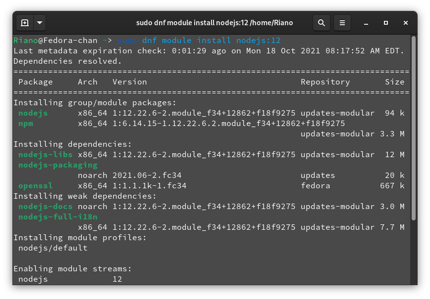

# Installing node.js 

    18 October 2021 08:13

## For 'CentOS, Fedora and Red Hat Enterprise Linux'

Node.js is available as a module called "nodejs" in CentOS/RHEL 8 and Fedora. 

```bash
- dnf module install nodejs:<stream>
```

...where `<stream>` corresponds to the major version of Node.js. To see a list of available streams: 

```bash
- dnf module list nodejs
```

**For example** , to install Node.js 12: 

```bash
- dnf module install nodejs:12
```




  [<-Previous Page](https://github.com/kanitmann/Learn_With_Me/blob/master/node.js/2.%20Features%20of%20NodeJS.MD)                                    
  
  [Next page ->](https://github.com/kanitmann/Learn_With_Me/blob/master/node.js/4.%20Hello%20World.MD)