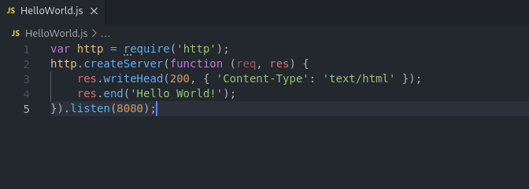
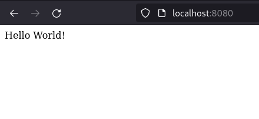

# Installing node.js 

    18 October 2021 08:27

## Hello World Program:

```js
var http = require('http');
http.createServer(function (req, res) {
    res.writeHead(200, { 'Content-Type': 'text/html' });
    res.end('Hello World!');
}).listen(8080);
```




------------------------

Check Output at [https://localhost:8080](https://localhost:8080).

## Output:




  [<-Previous Page](https://github.com/kanitmann/Learn_With_Me/blob/master/node.js/3.%20Installation.MD)                                    
  
  [Next page ->]()